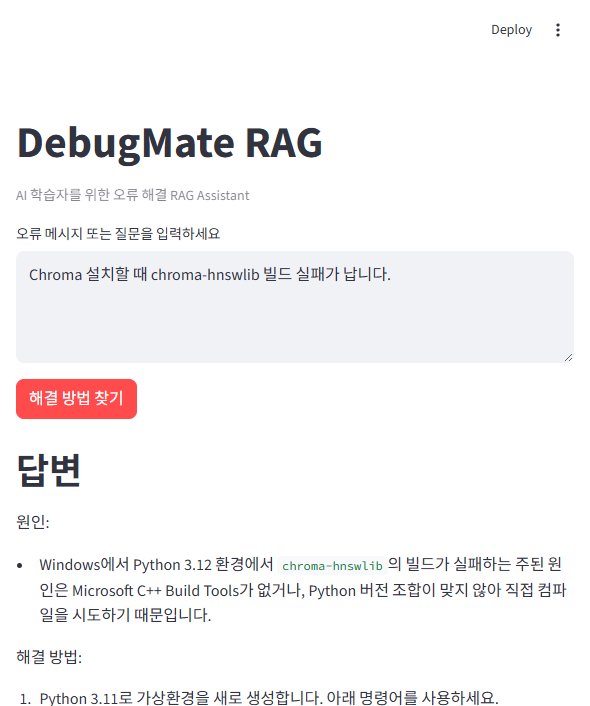
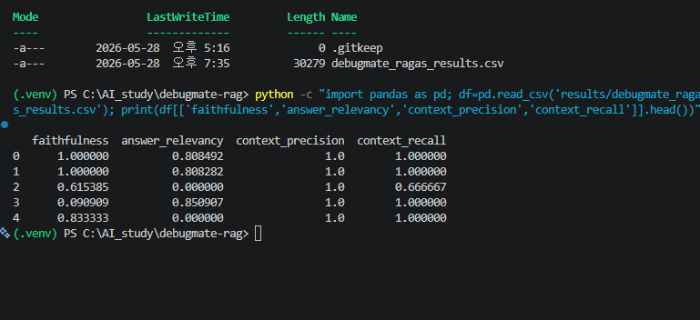

# DebugMate RAG

**AI 학습자를 위한 오류 해결 RAG Assistant**

DebugMate RAG는 AI 학습자가 반복적으로 겪는 개발 환경 오류, 패키지 오류, API 키 오류, Git 오류, RunPod 오류를 기록하고, RAG 기반 검색을 통해 원인과 해결 방법을 제공하는 DLthon용 MVP 프로젝트입니다.

---

## 1. 프로젝트 개요

AI 학습 과정에서는 모델 학습보다 환경 설정과 오류 해결에서 더 자주 막히는 경우가 많습니다.

대표적인 오류는 다음과 같습니다.

* `ModuleNotFoundError: No module named 'datasets'`
* `ModuleNotFoundError: No module named 'ragas'`
* `ModuleNotFoundError: No module named 'langchain_core'`
* `OpenAIError: The api_key client option must be set`
* `PermissionError: Chroma vectorstore file is being used`
* `git push rejected`
* PowerShell에서 `bash` 명령어 인식 실패
* Jupyter 커널과 pip 설치 환경 불일치
* RunPod 저장공간 유지 문제

DebugMate RAG는 이러한 오류 해결 경험을 문서화하고, 사용자가 오류 메시지나 상황을 입력하면 관련 문서를 검색하여 해결 방법을 제시하는 RAG 시스템입니다.

---

## 2. 문제 정의

AI 학습자는 같은 오류를 반복해서 겪어도 해결 방법을 다시 찾는 데 많은 시간을 사용합니다.

특히 Python 가상환경, Jupyter 커널, LangChain/RAGAS 패키지 버전, OpenAI API 키, GitHub, RunPod와 관련된 오류는 초보 학습자에게 반복적으로 발생합니다.

이 프로젝트는 다음 문제를 해결하고자 합니다.

> AI 학습 과정에서 반복적으로 발생하는 오류 해결 경험을 지식 문서로 저장하고, RAG 기반 검색을 통해 원인·해결 방법·주의사항을 빠르게 제공한다.

---

## 3. 프로젝트 목표

### 핵심 목표

사용자가 오류 메시지나 상황을 입력하면 다음 내용을 제공하는 RAG 시스템을 구현합니다.

1. 오류 원인
2. 해결 방법
3. 실행 명령어
4. 주의사항
5. 참고한 source 문서

### MVP 목표

DLthon MVP에서는 다음 기능에 집중합니다.

1. 오류 기록 데이터셋 구축
2. Multi Document RAG 구현
3. Metadata 기반 검색
4. Rule-based Query Router 구현
5. Source Citation 포함 답변 생성
6. Streamlit UI 구현

---

## 4. 핵심 기능

| 기능                 | 설명                                         |
| ------------------ | ------------------------------------------ |
| 오류 메시지 입력          | 사용자가 오류 메시지 또는 상황을 입력                      |
| 질문 유형 자동 분류        | 패키지 오류, API 키 오류, Git 오류, RunPod 오류 등으로 분류 |
| Metadata Filter 검색 | 오류 유형에 맞는 문서군을 우선 검색                       |
| RAG 답변 생성          | 검색된 문맥을 바탕으로 해결 답변 생성                      |
| Source Citation    | 답변에 사용된 문서 출처 표시                           |
| Streamlit UI       | 간단한 웹 데모 제공                                |
| RAGAS 평가           | 답변 품질을 정량적으로 평가                            |

---

## 5. 제외 범위

이번 DLthon MVP에서는 다음 기능은 제외합니다.

* 파인튜닝
* 오픈소스 LLM 직접 서빙
* vLLM 배포
* 복잡한 LangGraph Agent
* 대규모 데이터베이스 운영
* 로그인 기능
* 실제 명령어 자동 실행
* 장기 사용자 로그 저장

---

## 6. 시스템 구조

```text
사용자 오류 입력
        ↓
질문 유형 분류 Router
        ↓
Metadata Filter 선택
        ↓
Vector Search
        ↓
관련 오류 문서 검색
        ↓
LLM 답변 생성
        ↓
원인 / 해결 방법 / 주의사항 / source 출력
```

조금 더 기술적으로 표현하면 다음과 같습니다.

```text
Streamlit UI
→ Query Router
→ LangChain Retriever
→ Chroma Vector DB
→ OpenAIEmbeddings
→ ChatOpenAI
→ Answer with Sources
```

---

## 7. 기술 스택

| 영역              | 기술                             |
| --------------- | ------------------------------ |
| UI              | Streamlit                      |
| RAG Framework   | LangChain                      |
| Document Loader | TextLoader                     |
| Text Splitter   | RecursiveCharacterTextSplitter |
| Embedding       | OpenAIEmbeddings               |
| Vector DB       | Chroma                         |
| LLM             | GPT-4o-mini                    |
| 평가              | RAGAS                          |
| 환경 변수 관리        | python-dotenv                  |
| 코드 관리           | GitHub                         |

---

## 8. 프로젝트 구조

```text
debugmate-rag/
├── app.py
├── README.md
├── requirements.txt
├── .gitignore
├── app/
├── data/
│   ├── error_logs.txt
│   ├── runpod_notes.txt
│   ├── git_errors.txt
│   ├── jupyter_env_errors.txt
│   └── ragas_langchain_errors.txt
├── notebooks/
│   ├── multi_doc_rag.ipynb
│   └── ragas_eval.ipynb
├── results/
│   ├── ragas_summary.csv
│   └── ragas_all_results.csv
├── src/
│   ├── loader.py
│   ├── router.py
│   ├── retriever.py
│   ├── answer.py
│   └── evaluation.py
├── tests/
└── vectorstore/
    └── .gitkeep
```

---

## 9. 데이터 구성

오류 해결 문서는 `data/` 폴더에 저장합니다.

예상 데이터 파일은 다음과 같습니다.

```text
data/
├── error_logs.txt
├── runpod_notes.txt
├── git_errors.txt
├── jupyter_env_errors.txt
└── ragas_langchain_errors.txt
```

### 오류 기록 문서 형식

각 오류는 다음 형식으로 정리합니다.

```text
# 오류명
ModuleNotFoundError: No module named 'datasets'

## 상황
Jupyter Notebook에서 from datasets import Dataset 실행 시 오류 발생

## 원인
현재 Jupyter 커널에 datasets 패키지가 설치되어 있지 않음

## 해결 방법
1. 현재 커널 Python 경로 확인
import sys
print(sys.executable)

2. 현재 커널 기준으로 설치
python -m pip install datasets

또는 requirements.txt 설치
python -m pip install -r requirements.txt

## 주의사항
VS Code 터미널에서 설치한 Python과 Jupyter 커널 Python이 다를 수 있음

## 관련 태그
package_error, jupyter, python_env, datasets
```

---

## 10. Metadata 설계

각 문서 또는 chunk에는 metadata를 부여합니다.

예시:

```python
metadata = {
    "source": "error_logs.txt",
    "doc_type": "error_log",
    "error_type": "package_error",
    "tool": "jupyter",
    "topic": "datasets"
}
```

추천 metadata 필드는 다음과 같습니다.

| 필드           | 예시                                                                |
| ------------ | ----------------------------------------------------------------- |
| `source`     | `error_logs.txt`                                                  |
| `doc_type`   | `error_log`, `infra_note`, `git_note`, `rag_note`                 |
| `error_type` | `package_error`, `api_key_error`, `permission_error`, `git_error` |
| `tool`       | `jupyter`, `runpod`, `git`, `langchain`, `ragas`                  |
| `topic`      | `datasets`, `openai_api`, `chroma`, `github`                      |
| `difficulty` | `easy`, `medium`, `hard`                                          |

---

## 11. Query Router 설계

사용자 질문을 분석하여 적절한 문서군을 선택합니다.

| 사용자 질문                  | route              |
| ----------------------- | ------------------ |
| `datasets 오류가 나요`       | `package_error`    |
| `OpenAI API 키 오류가 나요`   | `api_key_error`    |
| `Chroma 폴더 삭제가 안 돼요`    | `permission_error` |
| `git push rejected가 떠요` | `git_error`        |
| `RunPod 저장이 안 돼요`       | `runpod`           |
| `RAGAS 설치가 안 돼요`        | `ragas_langchain`  |

초기 MVP에서는 rule-based router를 사용합니다.

```python
def route_query(query):
    query_lower = query.lower()

    if "modulenotfound" in query_lower or "no module named" in query_lower:
        return "package_error"

    if "api key" in query_lower or "openai_api_key" in query_lower:
        return "api_key_error"

    if "permissionerror" in query_lower or "삭제" in query_lower:
        return "permission_error"

    if "git" in query_lower or "push" in query_lower:
        return "git_error"

    if "runpod" in query_lower or "런포드" in query_lower:
        return "runpod"

    if "ragas" in query_lower or "langchain" in query_lower:
        return "ragas_langchain"

    return "general"
```

향후에는 LLM 기반 Router로 확장할 수 있습니다.

---

## 12. 답변 형식

DebugMate RAG의 답변은 항상 아래 형식을 따릅니다.

```text
원인:
현재 Jupyter 커널에 datasets 패키지가 설치되어 있지 않습니다.

해결 방법:
1. 현재 커널 Python 경로를 확인합니다.
2. 해당 Python에 datasets를 설치합니다.
3. 커널을 재시작합니다.

명령어:
python -m pip install datasets

주의사항:
VS Code 터미널과 Jupyter 커널이 다른 Python을 사용할 수 있습니다.

참고 문서:
- error_logs.txt
- jupyter_env_errors.txt
```

---

## 13. Streamlit UI 구성

Streamlit 데모 화면은 다음 요소로 구성합니다.

```text
제목: DebugMate RAG

[오류 메시지 입력창]

[질문 유형 자동 분류 결과]

[해결 답변]

[참고한 source 문서]

[검색된 context 펼쳐보기]

[피드백 버튼: 도움이 됨 / 부족함]
```

### 예시 입력

```text
ModuleNotFoundError: No module named 'datasets'
```

### 예시 출력

```text
분류: package_error

원인:
현재 Jupyter 커널에 datasets 패키지가 설치되어 있지 않습니다.

해결 방법:
python -m pip install datasets

주의사항:
현재 노트북 커널의 sys.executable을 확인하세요.

참고 문서:
error_logs.txt
```

---

## 실행 방법

### 1. 프로젝트 폴더로 이동

Windows PowerShell에서 프로젝트 폴더로 이동합니다.

```powershell
cd C:\AI_study\debugmate-rag
```

현재 위치가 프로젝트 폴더인지 확인합니다.

```powershell
pwd
```

출력이 아래와 비슷해야 합니다.

```text
C:\AI_study\debugmate-rag
```

---

### 2. 가상환경 생성

아직 `.venv` 폴더가 없다면 먼저 가상환경을 생성합니다.

```powershell
python -m venv .venv
```

생성 후 `.venv` 폴더가 있는지 확인합니다.

```powershell
dir -Force
```

목록에 `.venv`가 보여야 합니다.

---

### 3.가상환경 생성 및 활성화

Windows PowerShell에서 프로젝트 폴더로 이동합니다.

```powershell
cd C:\AI_study\debugmate-rag
```

정상적으로 활성화되면 터미널 앞에 `(.venv)`가 표시됩니다.

```text
(.venv) PS C:\AI_study\debugmate-rag>
```

---

### 4. PowerShell 실행 정책 오류가 날 경우

만약 아래와 같은 오류가 발생하면:

```text
running scripts is disabled on this system
```

다음 명령어를 실행합니다.

```powershell
Set-ExecutionPolicy -Scope Process -ExecutionPolicy RemoteSigned
```

그다음 다시 가상환경을 활성화합니다.

```powershell
.\.venv\Scripts\Activate.ps1
```

한 줄로 실행하려면 다음 명령어를 사용할 수 있습니다.

```powershell
(Set-ExecutionPolicy -Scope Process -ExecutionPolicy RemoteSigned) ; (& .\.venv\Scripts\Activate.ps1)
```

---

### 5. 패키지 설치

가상환경이 활성화된 상태에서 패키지를 설치합니다.

```powershell
python -m pip install -U pip
python -m pip install -r requirements.txt
```

---

### 6. 환경변수 설정

프로젝트 루트에 `.env` 파일을 생성합니다.

```powershell
notepad .env
```

아래 내용을 입력하고 저장합니다.

```text
OPENAI_API_KEY=본인_API_KEY
```

`.env` 파일은 GitHub에 업로드하지 않습니다.

---

### 7. Streamlit 실행

```powershell
streamlit run app.py
```


```bash
streamlit run app.py
```

---

## 15. 예시 질문

```text
ModuleNotFoundError: No module named 'datasets' 오류는 어떻게 해결하나요?
```

```text
OpenAI API 키 오류가 났을 때 어떻게 해야 하나요?
```

```text
Chroma vectorstore 폴더 삭제가 안 되는 이유는 무엇인가요?
```

```text
RunPod에서 저장공간을 유지하려면 어떻게 해야 하나요?
```

```text
Git push rejected 오류는 어떻게 해결하나요?
```

```text
Jupyter 커널과 pip 설치 환경이 다른 문제는 어떻게 확인하나요?
```

---

## 16. 평가 방법

RAGAS를 사용하여 답변 품질을 평가합니다.

### 평가 질문 예시

```text
1. datasets 오류는 왜 발생하나요?
2. OpenAI API 키 오류는 어떻게 해결하나요?
3. Chroma vectorstore 삭제 오류는 왜 발생하나요?
4. Git push rejected 오류는 어떻게 해결하나요?
5. RunPod에서 저장공간을 유지하려면 어떻게 해야 하나요?
```

### 평가 지표

| 지표                  | 의미               |
| ------------------- | ---------------- |
| `faithfulness`      | 답변이 근거 문서에 충실한가  |
| `answer_relevancy`  | 답변이 질문에 적절한가     |
| `context_precision` | 검색된 문서가 유용한가     |
| `context_recall`    | 필요한 문서를 충분히 찾았는가 |

---

## 17. 성공 기준

DLthon MVP의 성공 기준은 다음과 같습니다.

1. 사용자가 오류 메시지를 입력하면 관련 오류 문서를 검색한다.
2. 원인과 해결 방법을 단계별로 답변한다.
3. 답변에 source를 표시한다.
4. 최소 5개 오류 질문에 대해 정상 동작한다.
5. RAGAS 평가 결과를 제시한다.
6. Streamlit에서 시연 가능하다.

---

## 18. 발표 시나리오

### 1. 문제 제기

AI 학습자는 모델 학습보다 환경 설정과 오류 해결에서 더 자주 막힙니다.

### 2. 해결 아이디어

반복 오류를 문서화하고, RAG 기반으로 검색 가능한 오류 해결 비서를 만듭니다.

### 3. 시스템 구조

```text
오류 입력
→ 질문 라우팅
→ metadata filter
→ RAG 검색
→ 답변 생성
→ source 출력
```

### 4. 데모

다음 오류를 입력하여 시연합니다.

```text
ModuleNotFoundError: No module named 'datasets'
```

```text
OpenAIError: The api_key client option must be set
```

```text
PermissionError: Chroma vectorstore file is being used
```

### 5. 평가

RAGAS로 `faithfulness`, `answer_relevancy`, `context_precision`, `context_recall`을 측정합니다.

### 6. 한계와 개선

현재는 rule-based router를 사용합니다.
추후 LLM router, hybrid search, reranker, 오류 로그 자동 저장으로 확장할 수 있습니다.

---

## 19. 기대 효과

* 반복적인 오류 해결 시간 감소
* AI 학습 과정의 오류 경험 자산화
* 근거 기반 답변으로 신뢰성 향상
* RAG 구조와 평가 방법을 실제 문제 해결에 적용
* 최종 프로젝트의 AI Engineering Learning Copilot으로 확장 가능

---

## 20. 향후 개선 방향

* LLM 기반 Query Router
* Hybrid Search
* Reranker 적용
* RAGAS 평가 자동화
* 오류 로그 자동 저장
* FastAPI 백엔드 분리
* Docker 배포
* 사용자 피드백 저장
* 최종 프로젝트용 AI Engineering Learning Copilot으로 확장

---

## 21. 한 줄 요약

DebugMate RAG는 AI 학습자가 반복적으로 겪는 개발 환경 오류와 라이브러리 오류를 문서화하고, RAG 기반 검색과 source citation을 통해 원인·해결 방법·주의사항을 제공하는 DLthon용 MVP 프로젝트입니다.

---

## 현재 구현 완료 기능

DebugMate RAG MVP는 다음 기능을 구현했습니다.

* AI 학습 오류 기록 데이터셋 구축
* LangChain `TextLoader` 기반 문서 로드
* 오류 유형별 metadata 부여
* Rule-based Query Router 구현
* Chroma 기반 vector search 구현
* OpenAIEmbeddings 기반 문서 embedding
* ChatOpenAI 기반 오류 해결 답변 생성
* 참고 source 문서 출력
* Streamlit 기반 웹 UI 구현
* RAGAS 기반 답변 품질 평가

---

## 실행 방법

### 1. 프로젝트 폴더 이동

```powershell
cd C:\AI_study\debugmate-rag
```

### 2. 가상환경 활성화

```powershell
(Set-ExecutionPolicy -Scope Process -ExecutionPolicy RemoteSigned) ; (& C:\AI_study\debugmate-rag\.venv\Scripts\Activate.ps1)
```

정상 확인:

```powershell
python --version
```

예상 출력:

```text
Python 3.11.9
```

### 3. Chroma 설치 확인

```powershell
python -c "import chromadb; import langchain_chroma; print('Chroma 설치 성공')"
```

### 4. 환경변수 설정

프로젝트 루트에 `.env` 파일을 만들고 다음 값을 설정합니다.

```text
OPENAI_API_KEY=본인_API_KEY
```

`.env` 파일은 `.gitignore`에 의해 GitHub에 업로드되지 않습니다.

확인:

```powershell
git check-ignore -v .env
```

### 5. Streamlit 실행

```powershell
streamlit run app.py
```

---

## 예시 질문

다음 질문으로 DebugMate RAG를 테스트할 수 있습니다.

```text
ModuleNotFoundError: No module named 'datasets' 오류는 어떻게 해결하나요?
```

```text
OpenAI API 키 오류가 났을 때 어떻게 해야 하나요?
```

```text
git push rejected 오류는 어떻게 해결하나요?
```

```text
RunPod에서 Network Volume은 언제 필요한가요?
```

```text
Chroma 설치할 때 chroma-hnswlib 빌드 실패가 납니다.
```

---

## 시스템 구조

```text
사용자 오류 입력
        ↓
Rule-based Query Router
        ↓
Metadata Filter 선택
        ↓
Chroma Vector Search
        ↓
관련 오류 문서 검색
        ↓
ChatOpenAI 답변 생성
        ↓
원인 / 해결 방법 / 주의사항 / 참고 source 출력
```

---

## RAGAS 평가

DebugMate RAG는 RAGAS를 사용하여 답변 품질을 평가합니다.

평가 지표는 다음과 같습니다.

| 지표                  | 의미                |
| ------------------- | ----------------- |
| `faithfulness`      | 답변이 검색된 문서에 충실한가  |
| `answer_relevancy`  | 답변이 질문과 관련 있는가    |
| `context_precision` | 검색된 문서가 유용한가      |
| `context_recall`    | 필요한 문서를 충분히 검색했는가 |

평가 실행:

```powershell
python src\evaluation.py
```

결과 파일:

```text
results/debugmate_ragas_results.csv
```

---

## 프로젝트 차별점

단순 오류 해결은 GPT에게 직접 질문해도 가능하다.

하지만 DebugMate RAG는 일반적인 답변이 아니라, 사용자가 실제로 겪은 오류 기록과 프로젝트 환경을 기반으로 답변한다.

즉, DebugMate RAG의 핵심은 다음과 같다.

* 개인 오류 경험을 데이터셋으로 축적
* 프로젝트 환경 기준 해결 방법 제공
* 참고 source 문서 출력
* 반복 오류를 빠르게 재검색
* RAGAS 평가를 통한 품질 확인

---

## 한계

현재 MVP에는 다음 한계가 있습니다.

1. Router가 rule-based 방식이므로 질문 표현이 다양해지면 분류 정확도가 떨어질 수 있습니다.
2. 오류 데이터셋이 수동 작성 방식이므로 데이터 확장에 시간이 필요합니다.
3. Chroma는 현재 메모리 기반으로 사용하며, 앱 실행 시 매번 vectorstore를 다시 생성합니다.
4. RAGAS 평가는 참고 지표이며, 사람이 직접 보는 정성 평가도 함께 필요합니다.
5. 실제 명령어를 자동 실행하지 않고, 해결 방법 안내까지만 제공합니다.

---

## 향후 개선 방향

향후 다음 기능으로 확장할 수 있습니다.

1. LLM 기반 Query Router 적용
2. Hybrid Search 적용
3. Reranker 적용
4. 저장형 Chroma 또는 Qdrant 적용
5. 오류 로그 자동 저장 기능 추가
6. 사용자 피드백 저장
7. RAGAS 평가 대시보드 구현
8. FastAPI 백엔드 분리
9. Docker 배포
10. 최종 프로젝트용 AI Engineering Learning Copilot으로 확장

---

## 한 줄 요약

DebugMate RAG는 AI 학습자가 실제로 겪은 오류 기록을 기반으로, RAG 검색과 source citation을 통해 개인화된 오류 해결 답변을 제공하는 DLthon용 MVP입니다.

## Streamlit 데모 화면



## RAGAS 평가 결과



초기 MVP 평가 결과, 검색된 context의 precision과 recall은 높게 나타났지만 일부 질문에서 answer relevancy와 faithfulness가 낮게 측정되었다. 이는 현재 rule-based router와 기본 프롬프트 기반 구조의 한계로, 향후 LLM router, hybrid search, reranker, 프롬프트 개선을 통해 보완할 수 있다.